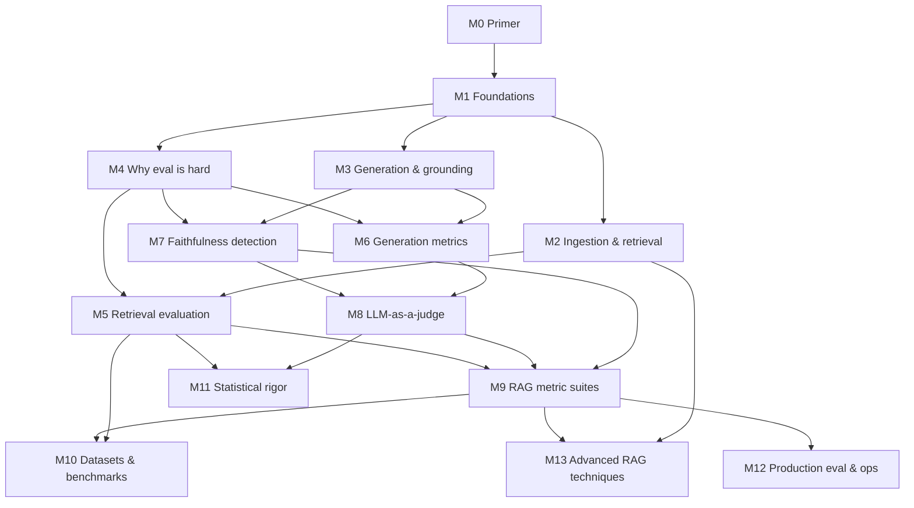

# Concept map

The universe of concepts a practitioner must master to **understand, build, and
evaluate** a production RAG system — and the dependency order between them. This
is the Phase-1 artifact (see [`handbook-method.md`](./handbook-method.md)); the
syllabus (Phase 2) is derived from it by topologically ordering these concepts
into lessons.

**Every concept is anchored to a verified source** in
[`sources.md`](./sources.md); the `[§N: short-name]` tags point there. A concept
with no backing source does not belong here.

## How to read this

- **Modules** (M0–M13) are thematic clusters. The arrows below are the
  module-level dependency graph — what must be understood before what.
- Inside each module, concepts are listed in learning order; inline `(needs …)`
  notes mark cross-module prerequisites.
- This is the *concept* graph, not the lesson list. Lesson granularity and the
  per-lesson `## Prerequisites` edges are decided in Phase 2 from this map.

---

## M0 — Primer (foundations assumed by everything below)

For readers with no LLM background. Black-box depth: enough to build and evaluate, not to train.

- **What an LLM is & autoregressive generation**: predicts text token by token from a prompt. `[§12: Vaswani]` `[§12: Brown]`
- **Tokens & the context window**: text is split into tokens; the model sees a bounded window — the reason chunking and per-token cost exist. `[§12: Sennrich BPE]`
- **Prompting & in-context learning**: instruction + context + question assembled into one prompt; few-shot examples steer behavior. `[§12: Brown]`
- **Sampling: temperature & top-p**: generation is stochastic (same prompt → different outputs), which is why LLM-judges must be pinned. `[§12: Holtzman]`
- **Embeddings & vector similarity**: text → vectors; nearby ≈ similar meaning; cosine vs dot product. `[§12: word2vec]` `[§4: Intro to IR]`
- **Semantic vs keyword search**: matching meaning vs matching words — the split behind dense vs sparse retrieval. `[§4: Intro to IR]`
- **Parametric vs non-parametric knowledge**: knowledge baked into weights vs fetched at inference — the core idea RAG rests on. `[§1: Lewis RAG paper]`

## M1 — Foundations & motivation

- **Why RAG exists**: LLM knowledge cutoff, hallucination, no grounding/provenance. `[§6: Hallucination survey]` `[§1: RAG survey]`
- **What RAG is**: retriever + generator over an external knowledge source. `[§1: Lewis RAG paper]`
- **The RAG pipeline**: index → retrieve → augment prompt → generate. `[§1: RAG survey]`
- **RAG paradigms**: naive vs advanced vs modular. `[§1: RAG survey]`

## M2 — Ingestion & retrieval building blocks  (needs M0, M1)

*Ingestion — getting clean, indexed data — comes before retrieval; production RAG lives or dies here.*

- **Document loading & parsing**: raw PDF/HTML/scanned files → text; layout-aware extraction (reading order, structure) and tables. `[§13: Unstructured]` `[§13: LayoutLMv3]` `[§13: PubTables-1M]`
- **Cleaning, normalization & deduplication**: strip boilerplate; remove near-duplicates so the top-k isn't crowded. `[§13: Deduplication]`
- **Documents & chunking**: fixed-size vs structural/semantic chunking; chunk size and retrieval granularity. `[§3: Dense X Retrieval]` `[§9: Searching for Best Practices]`
- **Metadata extraction**: derive titles/dates/sections — the supply side for metadata filtering (below). `[§13: Unstructured]`
- **Embeddings**: dense vector representations of text. `[§3: Sentence-BERT]`
- **Embedding model selection & adaptation**: choosing / fine-tuning the embedder for your domain and cost. `[§3: GTR]` `[§4: MTEB]`
- **Sparse retrieval**: TF-IDF, Okapi BM25. `[§4: Intro to IR]` `[§3: BM25]`
- **Dense retrieval**: dual-encoder / DPR. `[§3: DPR]`
- **Vector indexes / ANN**: HNSW, FAISS; comparing implementations (recall vs throughput). `[§3: HNSW]` `[§3: FAISS]` `[§3: ANN-Benchmarks]`
- **Vector store landscape & selection**: the store taxonomy — *native* vector DBs (Milvus, Qdrant, Weaviate, Chroma), *extended* SQL systems (pgvector on Postgres), and *search engines & libraries* (Elasticsearch/OpenSearch, Lucene, FAISS) — and how to choose (hybrid queries, scale, ops, embedded vs server). `[§3: Vector DBMS survey]` (per-store capabilities → each store's official docs)
- **Hybrid retrieval**: combining lexical + semantic. `[§3: Hybrid]` `[§3: COIL]`
- **Reranking**: cross-encoder / seq2seq rerankers. `[§3: monoBERT]` `[§3: monoT5]`
- **Parent-document / small-to-big**: retrieve small, return larger context. `[§3: Parent-document]`
- **Metadata filtering & index lifecycle**: filter ANN by metadata (tenant, recency, doc-type); incremental upsert/delete/re-embed (freshness). `[§3: pgvector]`

## M3 — Generation & grounding  (needs M1)

- **Generation conditioned on context**: prompting the LLM with retrieved passages. `[§1: Lewis RAG paper]`
- **Context-position effects**: "lost in the middle", chunk ordering. `[§1: Lost in the Middle]`
- **Faithfulness / groundedness**: answer supported by context vs fabricated. `[§6: Hallucination survey]`
- **Hallucination types**: intrinsic vs extrinsic. `[§6: Hallucination survey]`
- **Citation / attribution generation**: make the generator emit inline citations to the sources it used. `[§6: ALCE]`
- **Security — indirect prompt injection**: malicious instructions hidden in retrieved/external content. `[§11: Greshake]` `[§11: OWASP]`

## M4 — Why evaluation is hard (eval foundations)  (needs M1)

- **Eval targets**: retrieval quality vs generation quality (separable failure modes). `[§8: RAGAS paper]` `[§9: Eval-of-RAG survey]`
- **Reference-based vs reference-free** evaluation. `[§8: RAGAS paper]`
- **Offline vs online** evaluation. `[§10: Online Eval for IR]`
- **Pipeline error attribution & the retrieval recall ceiling**: generation quality is capped by what retrieval surfaced; attribute end-to-end failures to the right stage. `[§9: Eval-of-RAG survey]`
- **Eval design**: choose which metrics fit the use case; baselines & ablation (change one component, attribute the delta). `[§9: Eval-of-RAG survey]` `[§9: Searching for Best Practices]`
- **Eval targets beyond retrieval/generation**: negative rejection / abstention ("I don't know"), noise & counterfactual robustness. `[§9: Eval-of-RAG survey]` `[§9: RGB]`

## M5 — Retrieval evaluation  (needs M2, M4)

- **Relevance & test collections**: qrels, the Cranfield/TREC paradigm. `[§4: TREC]` `[§4: Intro to IR]`
- **Set metrics**: precision@k, recall@k. `[§4: Intro to IR]`
- **Rank-aware metrics**: MRR, MAP. `[§4: Intro to IR]`
- **Graded relevance**: DCG / nDCG. `[§4: nDCG]`
- **Retrieval & embedding benchmarks**: BEIR, MTEB. `[§4: BEIR]` `[§4: MTEB]`

## M6 — Generation evaluation: classical metrics & their limits  (needs M3, M4)

- **Lexical-overlap metrics**: BLEU, ROUGE, METEOR. `[§5: BLEU]` `[§5: ROUGE]` `[§5: METEOR]`
- **Embedding-based metrics**: BERTScore. `[§5: BERTScore]`
- **Why overlap metrics fail for RAG answers**: weak correlation with human judgment. `[§5: How NOT To Evaluate]`
- **Answer correctness vs ground truth**: semantic/factual match to a gold answer — distinct from faithfulness (grounded in context) and answer-relevancy (addresses the question). `[§8: RAGAS docs]`

## M7 — Faithfulness / hallucination measurement  (needs M3, M4)

- **NLI / entailment-based consistency**: FactCC, SummaC. `[§6: FactCC]` `[§6: SummaC]`
- **Atomic-fact precision**: FActScore. `[§6: FActScore]`
- **Sampling-consistency detection**: SelfCheckGPT. `[§6: SelfCheckGPT]`
- **Production scorers**: Vectara HHEM. `[§6: HHEM]`
- **Hallucination benchmarks**: TruthfulQA, RAGTruth. `[§6: TruthfulQA]` `[§6: RAGTruth]`
- **Citation / attribution-quality evaluation**: do the cited sources actually support the claim? (citation precision/recall). `[§6: ALCE]`

## M8 — LLM-as-a-judge  (needs M6, M7)

- **The LLM-as-judge idea & its validity** vs human preference. `[§7: MT-Bench]`
- **A concrete recipe**: G-Eval (CoT + form-filling). `[§7: G-Eval]`
- **Judge biases**: position, verbosity, self-enhancement. `[§7: MT-Bench]` `[§7: Fair Evaluators]`
- **Judge robustness / meta-evaluation**: LLMBar. `[§7: LLMBar]`
- **Field overview**: LLM-as-a-judge survey. `[§7: Judge survey]`
- **Reproducibility of judged scores**: pin temperature/seed/judge-model version; report score variance across runs. `[§7: Judge survey]` `[§7: G-Eval]`

## M9 — RAG-specific metric suites (frameworks)  (needs M5, M7, M8)

- **RAGAS metrics**: faithfulness, context precision, context recall, answer relevancy, noise sensitivity. `[§8: RAGAS paper]` `[§8: RAGAS docs]`
- **The RAG triad**: context relevance, groundedness, answer relevance. `[§8: TruLens]`
- **ARES methodology**: fine-tuned judges + prediction-powered inference. `[§8: ARES]`
- **Cross-framework view**: DeepEval RAG metrics. `[§8: DeepEval]`

## M10 — Datasets, benchmarks & synthetic test generation  (needs M5, M9)

- **QA datasets as ground truth**: Natural Questions, HotpotQA, TriviaQA, MS MARCO, KILT. `[§9: Natural Questions]` `[§9: HotpotQA]` `[§9: TriviaQA]` `[§9: MS MARCO]` `[§9: KILT]`
- **RAG-specific benchmarks**: RGB, CRUD-RAG, CRAG-benchmark, MultiHop-RAG. `[§9: RGB]` `[§9: CRUD-RAG]` `[§9: CRAG benchmark]` `[§9: MultiHop-RAG]`
- **Synthetic test-set generation** for RAG. `[§9: MultiHop-RAG]` `[§8: RAGAS docs]`
- **Eval methodology surveys / best practices**. `[§9: Eval-of-RAG survey]` `[§9: Searching for Best Practices]`
- **Benchmark data contamination / test-set leakage**: test items leaking into pretraining inflate scores and invalidate benchmarks. `[§9: Data contamination survey]`
- **Building a golden eval set**: query sampling, annotation guidelines, annotator training & agreement. `[§4: TREC]` `[§7: Kiritchenko]` `[§7: Carletta]`
- **Held-out discipline / eval-set overfitting**: don't tune against your test set; keep a rarely-touched holdout (distinct from pretraining contamination). `[§7: Dwork]`

## M11 — Statistical rigor & methodology  (needs M5, M8; cross-cuts M6/M7/M9/M10)

- **Inter-annotator agreement**: Cohen's kappa, Krippendorff's alpha. `[§7: Carletta]` `[§7: Cohen]` `[§7: Krippendorff]`
- **Significance testing**: bootstrap / randomization for system comparison. `[§7: Riezler & Maxwell]`
- **Correlating automated metrics with human judgment** (the meta-question behind every metric). `[§5: How NOT To Evaluate]` `[§7: MT-Bench]`
- **Statistical power / sample size**: is the eval set big enough to trust the delta? `[§7: Card]`
- **Human-eval instruments**: Likert vs pairwise vs best-worst scaling; humans vs automated. `[§7: Kiritchenko]` `[§7: MT-Bench]`
- **Eval-driven development**: failure analysis → fix → re-eval loop, guarded by a held-out set. `[§9: Searching for Best Practices]` `[§7: Dwork]`

## M12 — Production evaluation & operations (LLMOps)  (needs M9)

- **Online vs offline eval; A/B testing & interleaving**. `[§10: Online Eval for IR]`
- **Observability & tracing**: spans, the GenAI OTel standard. `[§10: OpenTelemetry GenAI]` `[§10: LangSmith]` `[§10: Phoenix]` `[§10: Langfuse]`
- **Continuous / CI evaluation, monitoring & drift**. `[§10: LangSmith]` `[§10: Langfuse]` `[§8: RAGAS paper]`
- **Human-in-the-loop evaluation**. `[§10: Langfuse]`
- **Cost / latency / efficiency as first-class metrics**: trade answer quality against \$/query and p95 latency. `[§10: OpenTelemetry GenAI]` `[§9: Searching for Best Practices]`
- **Security & access control in production**: ACL-aware retrieval, data-leakage prevention, the OWASP LLM risk checklist. `[§11: OWASP]`
- **Guardrails / output validation**: input-output safety filtering, schema/format validation, refusal. `[§11: Llama Guard]` `[§11: NeMo Guardrails]`
- **PII, governance & right-to-erasure**: PII redaction before indexing; deleting a subject's data across embeddings, chunks, caches & logs (GDPR Art. 17). `[§11: GDPR Art.17]` `[§11: Presidio]` `[§11: NIST AI RMF]`
- **Feedback loops / data flywheel**: mine production signals (explicit & implicit) back into the eval set and improvements. `[§10: Online Eval for IR]`
- **System versioning & safe rollout**: version prompts/indexes/models; canary & shadow deploys with auto-rollback (distinct from A/B). `[§10: LangSmith]` `[§10: Langfuse]`
- **Business vs technical metrics**: deflection, task success, CSAT — and the gap between offline wins and outcomes. `[§10: Online Eval for IR]`

## M13 — Advanced RAG techniques (and how to evaluate them)  (needs M2, M9)

- **Query transformation**: HyDE, query rewriting. `[§2: HyDE]` `[§2: Query Rewriting]`
- **Multi-hop / iterative retrieval**: IRCoT, FLARE, Iter-RetGen. `[§2: IRCoT]` `[§2: FLARE]` `[§2: Iter-RetGen]`
- **Self-correcting RAG**: Self-RAG, Corrective RAG (CRAG technique). `[§2: Self-RAG]` `[§2: CRAG technique]`
- **Agentic RAG**. `[§2: Agentic RAG survey]`
- **Fusion**: RAG-Fusion + Reciprocal Rank Fusion. `[§2: RAG-Fusion]` `[§2: RRF]`
- **Query routing / "retrieve or not"**: classify whether (and where) to retrieve before retrieving. `[§9: Searching for Best Practices]`
- **Context curation**: post-retrieval compression/summarization and repacking/ordering of passages. `[§2: LongLLMLingua]` `[§1: Lost in the Middle]`
- **Contextual retrieval**: augment each chunk with chunk-specific context before indexing. `[§2: Anthropic Contextual Retrieval]`

---

## Coverage check

Every module is backed by ≥1 verified registry source, and every registry
section (§1–§13) is exercised by ≥1 module. Two adversarial audits were run on
2026-06-05: a first 3-lens pass (build/eval/consistency) and a deeper 5-lens pass
(ingestion, foundations, ops/governance, eval-methodology, vs-authoritative-curricula).
The second pass added the **M0 primer**, the **ingestion front-half of M2**,
**eval-methodology** concepts (M4/M10/M11), and the **governance/lifecycle** cluster
(M12) — all with newly verified sources (§12 primer, §13 ingestion, plus additions
to §2/§3/§7/§11). One source-misattribution (ARES on human-in-the-loop) was fixed.

Remaining items to revisit during Phase 3 (deep per-lesson research may add sources):

- **Synthetic test generation** (M10): currently leans on MultiHop-RAG + RAGAS
  docs; a dedicated method paper may be worth verifying in Phase 3.
- **Deliberately deferred as nice-to-have / out of core scope** (revisit only if
  a lesson needs them): late-interaction retrieval (ColBERT), GraphRAG,
  multimodal RAG, semantic caching, judge calibration, safety/toxicity eval,
  multi-turn/conversational RAG eval. Each would need a verified source first.
